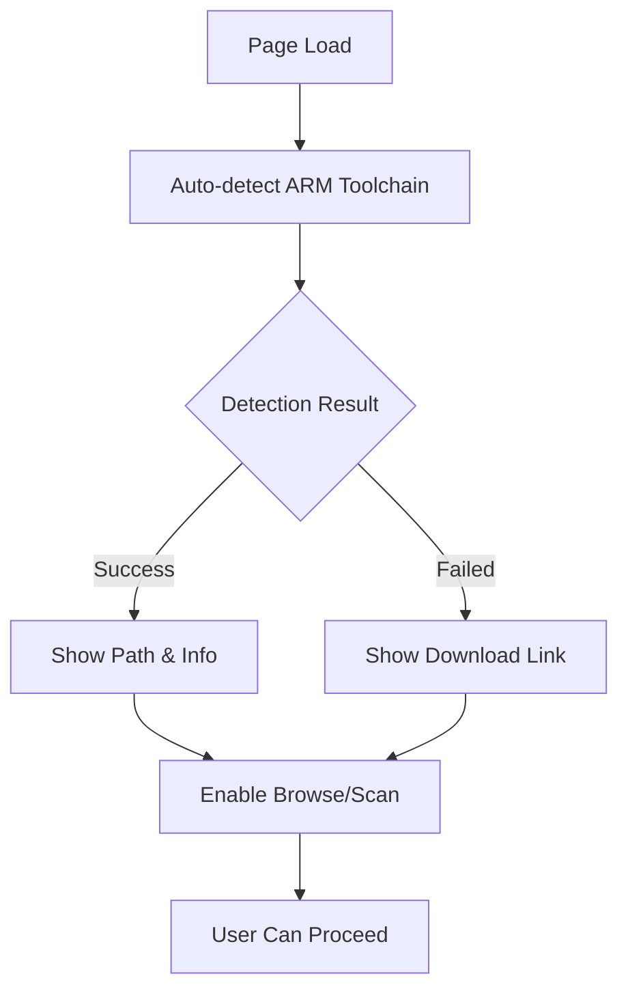
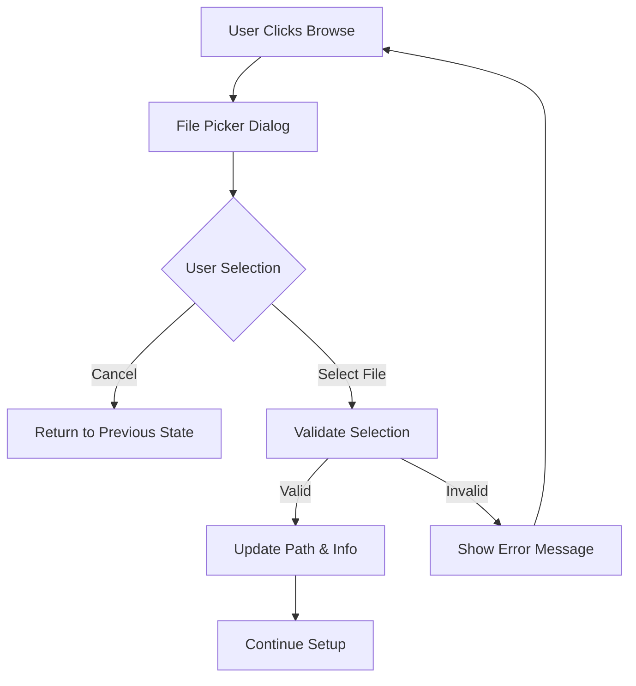
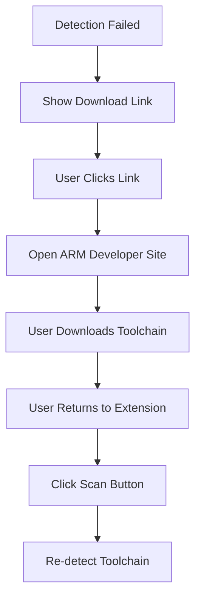

# ARM Toolchain Guidance Interface - UI/UX Specification

## Overview

This document provides detailed specifications for the ARM Toolchain Guidance Interface in the STM32 Debug Configurator extension. The design follows the existing OpenOCD patterns and provides intuitive user guidance for ARM toolchain setup.

## 1. UI Component Architecture

### 1.1 Webview Integration

The ARM toolchain guidance is integrated into the main webview interface (`src/webview/main.html`) with the following structure:

```html
<!-- ARM Toolchain Configuration Section -->
<div class="form-group" id="arm-toolchain-section">
    <label for="armToolchainPath" data-i18n="armToolchainPath">ARM Toolchain Path (Optional)</label>
    <div class="input-group">
        <input type="text" id="armToolchainPath" data-i18n-placeholder="autoDetecting">
        <button id="browse-arm-button" data-i18n="browseButton" title="Browse for ARM toolchain executable">Browse</button>
        <button id="refresh-arm-button" data-i18n="scanButton" title="Re-scan for ARM toolchain in system PATH">Scan</button>
    </div>
    <div id="arm-download-link-container" class="hidden">
        <small><span data-i18n="noArmToolchainFound">ARM Toolchain not found.</span> 
        <a href="https://developer.arm.com/downloads/-/arm-gnu-toolchain-downloads" data-i18n="downloadArmToolchain">Download it here</a>.</small>
    </div>
    <div id="arm-toolchain-info" class="toolchain-info hidden">
        <div class="info-row">
            <span class="info-label" data-i18n="version">Version:</span>
            <span id="arm-version" class="info-value">-</span>
        </div>
        <div class="info-row">
            <span class="info-label" data-i18n="target">Target:</span>
            <span id="arm-target" class="info-value">-</span>
        </div>
    </div>
</div>
```

### 1.2 Key UI Elements

1. **Path Input Field**: Text input for ARM toolchain path
2. **Browse Button**: File system browser for executable selection
3. **Scan/Refresh Button**: Auto-detection trigger
4. **Download Link**: Direct link to ARM developer site
5. **Toolchain Info Panel**: Version and target information display
6. **Status Indicators**: Visual feedback for detection results

## 2. User Interaction Flow

### 2.1 Initial State
- Path input field shows "Auto-detecting..." placeholder
- Browse and Scan buttons are enabled
- Download link is hidden
- Info panel is hidden

### 2.2 Auto-Detection Flow



### 2.3 Manual Configuration Flow



### 2.4 Download Guidance Flow



## 3. Visual Design Specifications

### 3.1 Component Styling

#### 3.1.1 Input Group Layout
- **Display**: `flex` layout with input field taking remaining space
- **Button Styling**: Consistent with OpenOCD browse/scan buttons
- **Border Radius**: Rounded corners following VS Code theme
- **Colors**: Uses VS Code theme variables for consistency

#### 3.1.2 Toolchain Info Panel
```css
.toolchain-info {
    margin-top: 8px;
    padding: 12px;
    background-color: var(--vscode-textBlockQuote-background);
    border: 1px solid var(--vscode-textBlockQuote-border);
    border-radius: 4px;
    font-size: 0.9em;
}
```

#### 3.1.3 Status Information Display
- **Version**: Displayed with monospace font
- **Target**: Shows toolchain target architecture
- **Colors**: Uses VS Code link color for values
- **Layout**: Flexible row layout with labels and values

### 3.2 Responsive Design

- **Mobile Support**: Buttons stack on smaller screens
- **Container Width**: Consistent with main form container (max-width: 600px)
- **Touch Targets**: Minimum 44px for mobile accessibility

## 4. Error Handling & User Feedback

### 4.1 Error States

1. **Detection Failed**: 
   - Show download link with clear messaging
   - Maintain button functionality for manual retry

2. **Invalid Path**: 
   - Input validation with error messaging
   - Clear guidance for resolution

3. **Permission Issues**: 
   - Context-aware error messages
   - Suggestions for resolution

### 4.2 Success States

1. **Detection Success**:
   - Display found path in input field
   - Show version and target information
   - Hide download link

2. **Manual Configuration Success**:
   - Confirm path selection
   - Update info panel
   - Enable continuation

## 5. Integration with Toolchain Guide Dialog

### 5.1 Dialog Enhancement

The existing `ToolchainGuideDialog` supports ARM toolchain with:

- **Progress Reporting**: ARM detection progress display
- **Result Formatting**: Dedicated ARM toolchain section
- **Download Links**: Direct ARM developer site links
- **Manual Configuration**: Path browsing for ARM toolchain

### 5.2 Download Link Configuration

Updated download links in `UserInteractionHandler`:
```typescript
{
    label: l10n.getString('downloadArmToolchain'),
    description: 'ARM GNU Toolchain (arm-none-eabi-gcc)',
    url: 'https://developer.arm.com/downloads/-/arm-gnu-toolchain-downloads'
}
```

## 6. Internationalization Support

### 6.1 New Localization Keys

**English (`en.ts`)**:
```typescript
armToolchainPath: "ARM Toolchain Path (Optional)",
noArmToolchainFound: "ARM Toolchain not found.",
armToolchainDetected: "ARM Toolchain found at:",
```

**Chinese (`zh.ts`)**:
```typescript
armToolchainPath: "ARM 工具链路径 (可选)",
noArmToolchainFound: "未找到 ARM 工具链。",
armToolchainDetected: "ARM 工具链检测到位置:",
```

### 6.2 Dynamic Content

All UI elements support dynamic language switching with proper data-i18n attributes.

## 7. Accessibility Features

### 7.1 Keyboard Navigation
- Tab order: Input → Browse → Scan
- Enter key triggers default action
- Escape key cancels dialogs

### 7.2 Screen Reader Support
- Proper labels for all interactive elements
- ARIA attributes for status announcements
- Semantic HTML structure

### 7.3 Visual Accessibility
- High contrast support via VS Code themes
- Focus indicators on interactive elements
- Clear visual hierarchy with proper headings

## 8. Implementation Notes

### 8.1 File Structure
- **HTML**: Enhanced `src/webview/main.html`
- **CSS**: Extended `src/webview/styles.css`
- **Localization**: Updated `src/localization/en.ts` and `src/localization/zh.ts`
- **Handler**: Enhanced `src/ui/userInteractionHandler.ts`

### 8.2 Dependencies
- Utilizes existing VS Code theming system
- Integrates with current localization framework
- Follows established UI patterns from OpenOCD implementation

### 8.3 Performance Considerations
- Lazy loading of toolchain information
- Efficient DOM manipulation
- Minimal impact on webview load time

## 9. Testing Strategy

### 9.1 Unit Tests
- UI component rendering
- User interaction handlers
- Localization string loading

### 9.2 Integration Tests
- Webview interaction flow
- Dialog integration testing
- Cross-platform compatibility

### 9.3 User Experience Tests
- Manual testing on different platforms
- Accessibility compliance verification
- Performance benchmarking

## 10. Future Enhancements

### 10.1 Planned Features
- Multiple toolchain version support
- Custom toolchain configuration profiles
- Advanced detection algorithms

### 10.2 User Feedback Integration
- Usage analytics for UX improvements
- Error reporting enhancement
- User preference storage

---

## Conclusion

This ARM Toolchain Guidance Interface provides a comprehensive, user-friendly solution that maintains consistency with existing OpenOCD patterns while offering intuitive ARM toolchain setup capabilities. The design prioritizes accessibility, internationalization, and seamless integration with the existing codebase architecture.